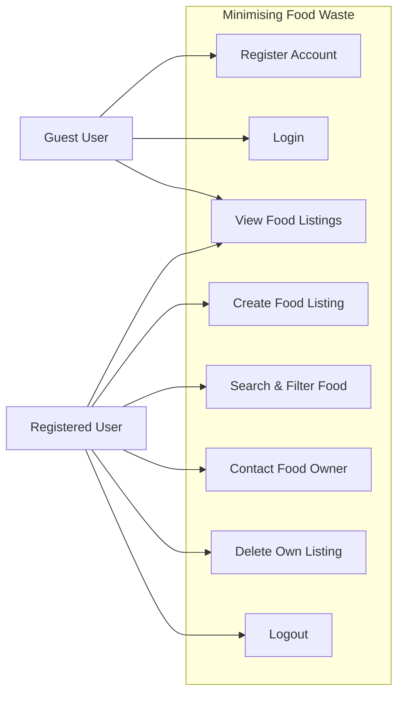

# FoodShare App - Minimising Food Waste Application

## Group Information
**Group Name:** CR7  
**Name of Students:**  
- Swagat Tharu (A00031512) - Leader  
- Sanjiv Kumar Sah (A00031801)  
- Aayusha Limbu (A00035325)  
- Tapendra Budha (A00031464)

## Project Overview
**Minimising Food Waste Application**  
The Minimising Food Waste application is a web-based platform designed to reduce food waste by allowing users to share surplus food within their local community. The system connects individuals who have extra food with those who can benefit from it, promoting sustainability and community support.

Many people, especially students and working individuals, often buy more food than they can consume before it expires. At the same time, others may struggle with food costs. This application aims to bridge that gap through a simple and secure food-sharing platform.

Users can register, create food listings, browse available items, filter by category, and contact food owners to arrange collection. The system is designed to be user-friendly, ethically responsible, and secure, with attention to privacy, safety, and fair use.

In upcoming sprints, the team will implement the core features, connect the database, and deploy the application using modern web technologies.

## How the Application Supports Sharing, Exchange, and Community
The application supports sharing and exchange by providing a platform where users can offer surplus food to others who need it.

By connecting people within a community, the system helps build trust, encourages sustainable behaviour, and reduces food waste.

This approach promotes community engagement, environmental responsibility, and mutual benefit, directly supporting the module theme of sharing, exchange, and building community.

## Code of Conduct
- All team members will communicate respectfully and professionally at all times.
- Team members will attend scheduled meetings and inform the group in advance if they are unable to attend.
- Tasks will be completed by the agreed deadlines, and any difficulties will be communicated early.
- All team members will contribute fairly to the project and participate in GitHub activities.
- No team member will submit work that they do not understand or that has been copied without permission.
- Feedback and disagreements will be handled constructively and respectfully.
- All members will follow university policies regarding academic integrity and ethical behaviour.

## Personas

### Persona 1: Sarah
- **Age:** 22
- **Occupation:** University student
- **Background:** Sarah lives in shared student accommodation and often buys more food than she can use before it expires.
- **Problem:** She feels bad throwing away food that is still good but has no easy way to share it with others.
- **Needs:** Sarah needs a simple and safe way to list surplus food items and connect with people nearby who can use them.

### Persona 2: Ahmed
- **Age:** 35
- **Occupation:** Part-time worker
- **Background:** Ahmed lives in the local community and sometimes struggles with food costs.
- **Problem:** He wants access to surplus food in his area but does not know where to find it.
- **Needs:** Ahmed needs a platform where he can easily find available food nearby and contact the person sharing it.

## Ethical Issues

### Privacy
The application will collect basic user information such as names and contact details.
User data must be protected and only used for the purpose of sharing food.
Personal information should not be shared publicly without the user’s consent, and access to data should be restricted to authorised users.

### Safety
Food safety is an important ethical concern for the application.
Users should be encouraged to share food responsibly and provide accurate information about the food being offered.
The platform should include guidance or disclaimers reminding users to check food quality and expiry dates before consumption.

### Fair Use
The application should be used fairly and respectfully by all users.
No user should exploit the platform for personal gain or misuse it to repeatedly take resources without contributing.
Clear rules should be in place to prevent abuse and ensure the system supports cooperation and community benefit.

---

## User Stories

### User Story 1 – User Registration
As a new user, I want to create an account, so that I can share or receive food within my local community.
**Acceptance Criteria:**
- User can enter name, email, and password.
- User account is successfully created.
- User can log in after registration.

### User Story 2 – User Login
As a registered user, I want to log in securely, so that I can access my account and manage food listings.
**Acceptance Criteria:**
- User can enter email and password.
- System verifies login details.
- User is redirected to their dashboard after successful login.

### User Story 3 – Share Food
As a user with surplus food, I want to list available food items, so that others can collect them and reduce food waste.
**Acceptance Criteria:**
- User must be logged in.
- User can add food title, description, category, and expiry date.
- Food listing appears in the public listings page.

### User Story 4 – View Available Food
As a community member, I want to view available food near me, so that I can request items I need.
**Acceptance Criteria:**
- User can see a list of available food items.
- Each listing shows basic details (title, description, expiry date).
- User can click to view full details.

### User Story 5 – Search and Filter Food
As a user, I want to filter food listings by category, so that I can quickly find suitable items.
**Acceptance Criteria:**
- User can select a category filter.
- Only relevant food items are displayed.
- User can reset the filter to see all items.

### User Story 6 – Contact Food Owner
As a user, I want to contact the person sharing food, so that I can arrange collection.
**Acceptance Criteria:**
- User can send a message to the food owner.
- Contact details are shared securely.
- Both users can communicate safely.

### User Story 7 – Remove Food Listing
As a user, I want to remove my listing once the food is collected, so that the system stays updated.
**Acceptance Criteria:**
- User can delete their own listing.
- Listing is removed from public view.
- System confirms successful removal.

---

## Design and Diagrams
*(Diagram images/placeholders attached in coursework)*
- **Use Case Diagram**

- **Activity Diagram:** Illustrates the main workflow of the Minimising Food Waste application and shows how users interact with the system. The process begins when a user registers and logs into the application. After successful authentication, the user can create a food listing by entering details such as food description, category, and expiry date. Once the listing is submitted, it is stored in the database and becomes visible to other users on the platform. Other users can browse available food listings, view detailed information about a selected item, and contact the food owner to arrange collection. This diagram highlights the core system flow and demonstrates how the application supports community-based food sharing.
- **Physical Module Of Database**
- **Wireframes:**
  1. Home page
  2. Listing page
  3. Item detail page
  4. User profile page
  5. Admin moderation panel

---

## Sprint 3 Planned Tasks
The following tickets have been created and assigned on the Kanban board for Sprint 3:
- Implement user list page
- Implement user profile page
- Implement food listing page
- Implement food detail page
- Implement category filtering
- Set up database connection (MySQL)
- Configure Docker development environment

Each ticket has been assigned to a specific team member and tracked using the GitHub project board to ensure progress and accountability throughout Sprint 3. *(Sprint 3 tickets prepared on Kanban board and assigned).*

## Meeting Records

### Meeting 1
- **Date:** 8 Feb 2026
- **Attendees:** All group members
- **Discussion:** Chose project idea: minimising food waste. Discussed assignment requirements and Sprint 1 deliverables. Created GitHub repository and project board.
- **Decisions:** Agreed on project focus. Assigned initial tasks to team members.

### Meeting 2
- **Date:** 9 Feb 2026
- **Attendees:** All group members
- **Discussion:** Reviewed progress on Sprint 1 tasks. Discussed personas and ethical issues. Confirmed project description.
- **Decisions:** Finalised Sprint 1 documentation. Prepared for submission to Moodle.

---

## Important Links
- **GitHub Repository:** [swagattharu55-lab/software-engineering-group-project](https://github.com/swagattharu55-lab/software-engineering-group-project)
- **Task Board / Kanban:** [Sprint 3 kanban board](https://github.com/users/swagattharu55-lab/projects/5)

---

## Tech Stack
- Frontend: HTML, CSS, JavaScript, Pug
- Backend: Node.js, Express.js
- Database: MySQL
- DevOps: Docker, Docker Compose
- CI/CD: GitHub Actions

## How to Run locally
1. Provide `.env` variables (already provided in the root directly locally).
2. Run database build via Docker:
   \`\`\`bash
   docker-compose up --build
   \`\`\`
3. Visit: http://localhost:3000

## Project Structure
\`\`\`text
software-engineering-group-project/
├── backend/
│   ├── controllers/
│   ├── models/
│   ├── routes/
│   ├── views/
│   │   ├── partials/
│   │   └── pages/
│   ├── db.js
│   ├── db_init.sql
│   ├── server.js
│   └── package.json
├── frontend/
│   ├── css/
│   └── js/
├── .env
├── .gitignore
├── Dockerfile
├── docker-compose.yml
└── README.md
\`\`\`